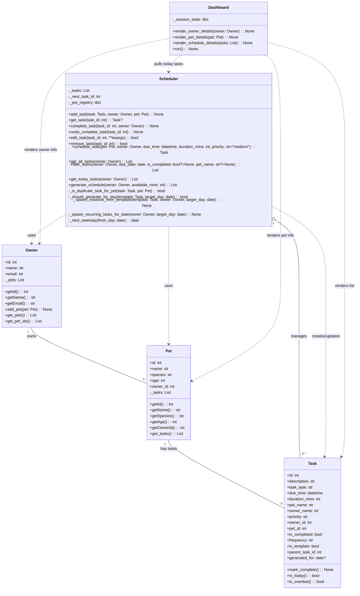
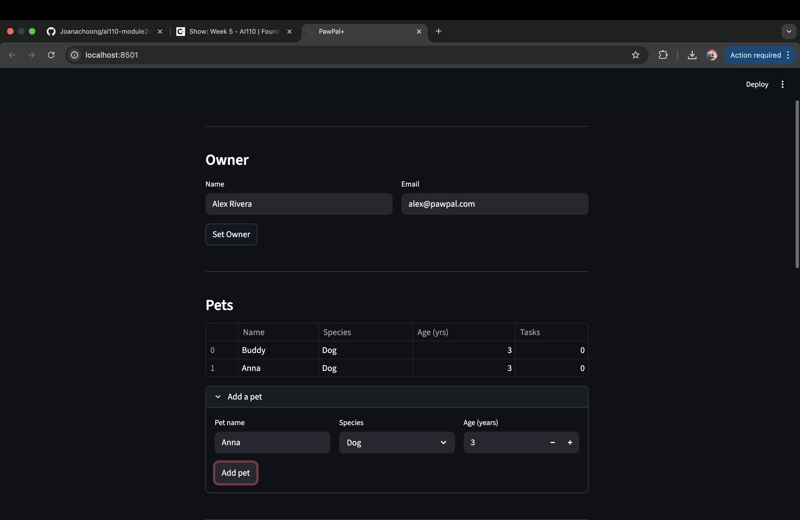
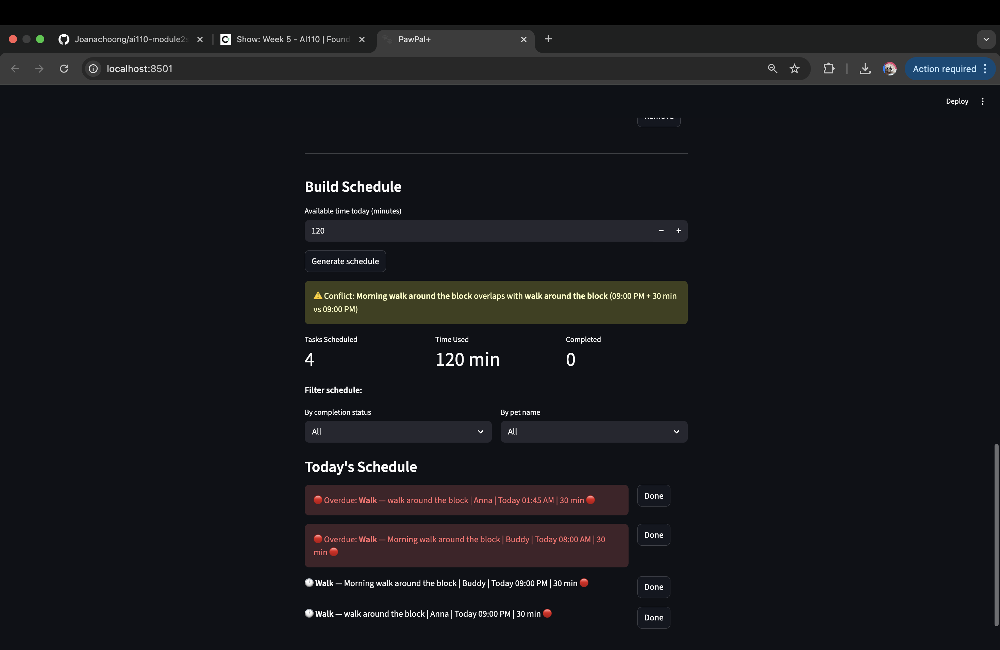

# PawPal+ (Module 2 Project)

You are building **PawPal+**, a Streamlit app that helps a pet owner plan care tasks for their pet.

## Scenario

A busy pet owner needs help staying consistent with pet care. They want an assistant that can:

- Track pet care tasks (walks, feeding, meds, enrichment, grooming, etc.)
- Consider constraints (time available, priority, owner preferences)
- Produce a daily plan and explain why it chose that plan

Your job is to design the system first (UML), then implement the logic in Python, then connect it to the Streamlit UI.

## What you will build

Your final app should:

- Let a user enter basic owner + pet info
- Let a user add/edit tasks (duration + priority at minimum)
- Generate a daily schedule/plan based on constraints and priorities
- Display the plan clearly (and ideally explain the reasoning)
- Include tests for the most important scheduling behaviors

### Setup

```bash
python -m venv .venv
source .venv/bin/activate  # Windows: .venv\Scripts\activate
pip install -r requirements.txt
```

### Suggested workflow

1. Read the scenario carefully and identify requirements and edge cases.
2. Draft a UML diagram (classes, attributes, methods, relationships).
3. Convert UML into Python class stubs (no logic yet).
4. Implement scheduling logic in small increments.
5. Add tests to verify key behaviors.
6. Connect your logic to the Streamlit UI in `app.py`.
7. Refine UML so it matches what you actually built.

### Features

- Deterministic schedule sorting: ranks tasks by overdue status first, then priority (high to medium to low), then earlier due time, then shorter duration.
- Time-budgeted scheduling: uses a greedy selection pass to add ranked tasks only while total duration stays within available minutes.
- Duplicate task conflict warnings: prevents adding duplicate tasks for the same pet and raises a clear error when a conflict is detected.
- Daily recurrence generation: creates today’s instance from daily templates automatically when fetching today’s tasks.
- Weekly weekday recurrence: generates weekly recurring tasks on business days (Mon-Fri), skipping weekends.
- Idempotent recurrence spawning: avoids creating duplicate generated instances for the same template and day.
- Complete-to-pre-spawn flow: when a recurring instance is completed, the next occurrence is automatically pre-generated.
- Undo completion rollback: un-completing a recurring task removes its pre-generated next occurrence if it is still incomplete.
- Template-child linkage: recurring instances track their parent template for traceability and lifecycle management.
- Cascading delete for recurring series: removing a template recursively removes all generated child tasks.
- Multi-filter task queries: supports filtering by due date, completion status, and pet name (case-insensitive).
- Today view dedup + actionability filter: returns only unique, actionable tasks due today or earlier (excludes templates and completed tasks).


### UML Diagram (Refined)



Notes:
- **Owner** controls pet membership via `add_pet()` and provides read access through `get_pets()` / `get_pet_ids()`.
- **Pet** passively holds its associated tasks (`_tasks`); tasks are added/removed only by Scheduler.
- **Task** now carries a `pet_id` field so Scheduler can sync removals back to the correct Pet.
- **Scheduler** is the sole authority for task mutation (`add_task`, `remove_task`, `edit_task`). It retrieves tasks by walking `owner.get_pets()` → `pet.get_tasks()`, not from a flat internal list.


### Smarter Scheduling


The scheduling system now goes beyond a simple task list and actively manages daily planning, recurring care routines. It automatically creates today’s recurring tasks, prioritizes what matters most, and builds a realistic plan based on available time.


1. Recurring task templates

Supports daily and weekday-based weekly recurrences.
Generates concrete task instances from templates instead of reusing the template itself.
Prevents duplicate generated instances for the same template/day pair.

2. Automatic “today” task preparation

When loading today’s tasks, recurring items due today are generated first.
The list includes actionable tasks due today and overdue tasks.
Completed tasks and template-only records are excluded from the actionable view.

3. Smarter prioritization logic

Scheduling ranks tasks in this order:
Overdue tasks first
Completion status 
Pet name
This flow ensure pet owner's know what task needs to be resolve first and which pet's task is incomplete if owner have multiple pet in the house.

4. Completion-aware recurrence flow

Completing a recurring instance pre-spawns the next expected occurrence.
Undoing completion reverses that change and removes the pre-spawned future instance (if still incomplete).
Keeps recurring plans consistent with user actions.

### Testing PawPal+ 

To run the test case: `python -m pytest`

Confidence lebel : 4/5

1. Basic task lifecycle behavior  
Verifies core functionality like marking a task complete and successfully adding tasks to a pet.

2. Conflict and duplicate detection  
Checks that true duplicates are rejected, including normalized descriptions (case/whitespace), while valid non-duplicates are accepted.

3. Sorting correctness for scheduling  
Validates that schedule output follows expected ordering rules, including overdue precedence and tie-breaking for same-time tasks.

4. Recurrence logic on completion  
Confirms daily recurring behavior by ensuring completing a generated daily task creates the next day’s task exactly once.

5. Query/filter and empty-state reliability  
Covers task filtering by date, completion status, and pet name (including case-insensitive matching), plus edge behavior when a pet has no tasks.

### Demo





